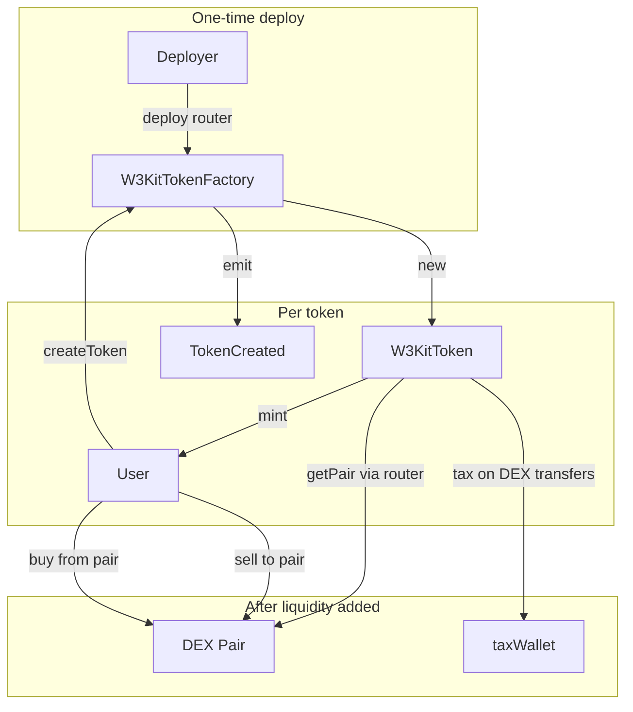

# Web3 Kit Token Factory

On-chain ERC-20 token factory for **BSC** and **Ethereum**. Anyone can deploy a new token through a single factory contract. Tokens support optional **immutable buy/sell tax** on PancakeSwap V2 and Uniswap V2 pairs.

---

## Features

- **One-click token deploy** — single `createToken()` call deploys a new ERC-20 and mints full supply to the caller
- **Multi-chain** — BSC mainnet/testnet, Ethereum mainnet, and Sepolia
- **Flexible metadata** — custom name, symbol, decimals (0–18), and total supply
- **Optional DEX tax** — separate immutable buy and sell tax (basis points)
- **PancakeSwap & Uniswap V2** — tax applies on pair buys/sells after liquidity is added
- **No admin backdoor** — no owner, pause, blacklist, or post-deploy mint on tokens
- **OpenZeppelin ERC-20** — built on OpenZeppelin Contracts v5
- **Hardhat ready** — compile, test, deploy, and verify scripts included
- **Gas optimized** — Solidity compiler optimizer enabled (200 runs)

---

## Commands

Install dependencies first:

```bash
npm install
```

Copy `.env.example` to `.env` and fill in your keys before deploy or verify.

### Compile

```bash
npx hardhat compile
```

### Test

```bash
npm test
```

Gas report:

```bash
set REPORT_GAS=true && npm test
```

On macOS/Linux use `REPORT_GAS=true npm test`.

### Deploy factory

```bash
# BSC testnet
npm run deploy:factory -- --network bscTestnet

# BSC mainnet
npm run deploy:factory -- --network bsc

# Ethereum Sepolia
npm run deploy:factory -- --network sepolia

# Ethereum mainnet
npm run deploy:factory -- --network eth
```

The deploy script prints the factory address and the verify command for your network.

### Verify on explorer

Factory constructor takes **one argument**: the DEX router address.

```bash
# BSC testnet
npx hardhat verify --network bscTestnet <FACTORY_ADDRESS> 0xD99D1c33F9fC3444f8101754aBC46c52416550D1

# BSC mainnet
npx hardhat verify --network bsc <FACTORY_ADDRESS> 0x10ED43C718714eb63d5aA57B78B54704E256024E

# Sepolia
npx hardhat verify --network sepolia <FACTORY_ADDRESS> 0xC532a74256D3Db42D0Bf7a0400fEFDbad7694008

# Ethereum mainnet
npx hardhat verify --network eth <FACTORY_ADDRESS> 0x7a250d5630B4cF539739dF2C5dAcb4c659F2488D
```

Replace `<FACTORY_ADDRESS>` with your deployed factory address.

For BSC verification, enable `BSCSCAN_API_KEY` in `hardhat.config.js`. Etherscan API key is used for Ethereum and Sepolia.

---

## Table of contents

- [Features](#features)
- [Commands](#commands)
- [How it works](#how-it-works)
- [Architecture](#architecture)
- [Contracts](#contracts)
- [Token parameters](#token-parameters)
- [DEX tax logic](#dex-tax-logic)
- [Validation rules](#validation-rules)
- [Supported networks](#supported-networks)
- [Project structure](#project-structure)
- [Setup](#setup)
- [Environment variables](#environment-variables)
- [Create a token](#create-a-token)
- [Frontend integration](#frontend-integration)
- [Security notes](#security-notes)
- [License](#license)

---

## How it works

1. **Deploy** `W3KitTokenFactory` once per chain with the correct DEX router.
2. Users call **`createToken()`** on the factory.
3. The factory deploys a new **`W3KitToken`** and mints the full supply to the caller.
4. If tax is enabled, transfers through the token's DEX liquidity pair are taxed automatically after liquidity is added.

---

## Architecture



| Contract | Role |
|----------|------|
| `W3KitTokenFactory` | Entry point. Validates inputs, deploys tokens, emits `TokenCreated`. |
| `W3KitToken` | ERC-20 (OpenZeppelin v5). Optional immutable buy/sell tax on V2 DEX pairs. |

**Stack:** Solidity 0.8.30 · Hardhat · OpenZeppelin Contracts ^5.6.1 · Ethers ^6

---

## Contracts

### W3KitTokenFactory

- Stores one immutable **DEX router** address (PancakeSwap or Uniswap V2) set at deploy time.
- Exposes **`createToken()`** — the only way to launch a new token from this factory.
- Emits **`TokenCreated`** with creator, token address, metadata, supply, and tax settings.

### W3KitToken

Standard ERC-20 with configurable decimals. Immutable at creation:

| Field | Description |
|-------|-------------|
| `buyTaxBps` | Buy tax in basis points (100 bps = 1%) |
| `sellTaxBps` | Sell tax in basis points |
| `taxWallet` | Receives tax; must be zero when tax is off |
| `router` | Used to resolve the token/WETH (or WBNB) pair |

No owner, no mint after creation, no tax changes after deploy — all tax settings are **immutable**.

---

## Token parameters

| Parameter | Type | Notes |
|-----------|------|-------|
| `name` | string | Required. No max length (longer strings cost more gas). |
| `symbol` | string | Required. No max length. |
| `decimals` | uint8 | 0–18. 18 is most common on BSC and Ethereum. |
| `totalSupply` | uint256 | Raw smallest units. Zero is not allowed. |
| `buyTaxBps` | uint16 | 0–10000 (100% max). 0 = no buy tax. |
| `sellTaxBps` | uint16 | 0–10000. 0 = no sell tax. |
| `taxWallet` | address | Required when any tax is set; must be zero when tax is off. |

**totalSupply and decimals:** supply must be entered in smallest units. For 1,000,000 tokens with 18 decimals, use 1,000,000 × 10¹⁸. With 8 decimals, use 1,000,000 × 10⁸.

---

## DEX tax logic

Tax applies only when a **liquidity pair exists** on the chain DEX (resolved via the router's factory and WETH/WBNB pair).

| Transfer direction | Tax applied |
|--------------------|-------------|
| Wallet → DEX pair (sell) | `sellTaxBps` |
| DEX pair → Wallet (buy) | `buyTaxBps` |
| Wallet → Wallet | No tax |
| Before pair is created | No tax |

Tax formula: `taxAmount = amount × taxBps / 10_000`

**Example:** 10% sell tax on 1000 tokens → 100 to `taxWallet`, 900 to the pair.

Compatible with **PancakeSwap V2** (BSC) and **Uniswap V2 Router02** (Ethereum).

---

## Validation rules

| Rule | Error |
|------|-------|
| Empty name | `EmptyName` |
| Empty symbol | `EmptySymbol` |
| decimals > 18 | `DecimalsTooHigh` |
| totalSupply == 0 | `ZeroSupply` |
| Tax on, taxWallet is zero | `TaxWalletRequired` |
| Tax off, taxWallet is set | `TaxWalletMustBeZero` |
| Factory deployed with zero router | `ZeroRouter` |

---

## Supported networks

| Network | Hardhat name | Chain ID | DEX router |
|---------|--------------|----------|------------|
| BSC Mainnet | `bsc` | 56 | PancakeSwap V2 — `0x10ED43C718714eb63d5aA57B78B54704E256024E` |
| BSC Testnet | `bscTestnet` | 97 | PancakeSwap V2 — `0xD99D1c33F9fC3444f8101754aBC46c52416550D1` |
| Ethereum Mainnet | `eth` | 1 | Uniswap V2 — `0x7a250d5630B4cF539739dF2C5dAcb4c659F2488D` |
| Sepolia | `sepolia` | 11155111 | Community Uniswap V2 — `0xC532a74256D3Db42D0Bf7a0400fEFDbad7694008` |

Routers are picked automatically in `scripts/deploy-factory.js` by chain ID.

---

## Project structure

| Path | Purpose |
|------|---------|
| `contracts/W3KitTokenFactory.sol` | Factory — deploy once per chain |
| `contracts/W3KitToken.sol` | ERC-20 + optional DEX tax |
| `contracts/mocks/MockUniswapV2.sol` | Test doubles for DEX |
| `scripts/deploy-factory.js` | Deploy factory and print verify steps |
| `test/W3KitTokenFactory.test.js` | Contract tests |
| `hardhat.config.js` | Networks and compiler settings |
| `.env.example` | Environment variable template |

---

## Setup

**Requirements:** Node.js 18+, npm

1. Clone the repository.
2. Run `npm install`.
3. Copy `.env.example` to `.env` and fill in your private key, RPC URLs, and API keys.

---

## Environment variables

Copy `.env.example` → `.env`. Never commit `.env`.

| Variable | Required | Purpose |
|----------|----------|---------|
| `PRIVATE_KEY` | Deploy / on-chain tx | Wallet key (64 hex chars, no `0x` prefix) |
| `ETH_SEPOLIA_RPC_URL` | Sepolia | RPC endpoint |
| `ETH_MAINNET_RPC_URL` | Ethereum mainnet | RPC endpoint |
| `BSC_TESTNET_RPC_URL` | BSC testnet | RPC endpoint |
| `BSC_MAINNET_RPC_URL` | BSC mainnet | RPC endpoint |
| `ETHERSCAN_API_KEY` | Verify on Etherscan | [etherscan.io/myapikey](https://etherscan.io/myapikey) |
| `BSCSCAN_API_KEY` | Verify on BscScan | [bscscan.com/myapikey](https://bscscan.com/myapikey) |
| `TOKEN_FACTORY_CONTRACT_ADDRESS_*` | Optional | Local record of deployed factory per network |

After deploy, copy the factory address into your frontend `w3kit/.env` using the key names printed by the deploy script.

---

## Create a token

After the factory is deployed, call **`createToken`** on the factory contract with name, symbol, decimals, totalSupply, buyTaxBps, sellTaxBps, and taxWallet.

- **No tax:** set both tax bps to `0` and `taxWallet` to the zero address.
- **With tax:** set buy/sell bps (e.g. 500 = 5%, 1000 = 10%) and a valid `taxWallet` address.

Listen for the **`TokenCreated`** event to get the new token address. Tax only applies after liquidity is added on the DEX pair (token + WBNB/WETH).

---

## Frontend integration

1. Set `TOKEN_FACTORY_CONTRACT_ADDRESS_<NETWORK>` in `w3kit/.env`.
2. Load the factory ABI from `artifacts/contracts/W3KitTokenFactory.sol/W3KitTokenFactory.json`.
3. Call `createToken` with user-supplied parameters.
4. Listen for `TokenCreated` to get the new token address.
5. Match `totalSupply` to the selected `decimals`.

The on-chain factory has no name/symbol length cap — do not add client-side length limits unless you want extra UX constraints.

---

## Security notes

- **Immutable tax** — buy/sell rates and `taxWallet` cannot be changed after token creation.
- **No admin on tokens** — no pause, blacklist, or post-deploy mint.
- **Router is fixed per factory** — factory must be deployed with the correct chain router.
- **Tax before liquidity** — no tax until a DEX pair exists; wallet-to-wallet transfers are never taxed.
- **Private keys** — keep `PRIVATE_KEY` in `.env` only; never commit or share.
- **Audit** — review contracts before mainnet use with real funds.

---

## License

MIT (contracts: SPDX-License-Identifier: MIT)
