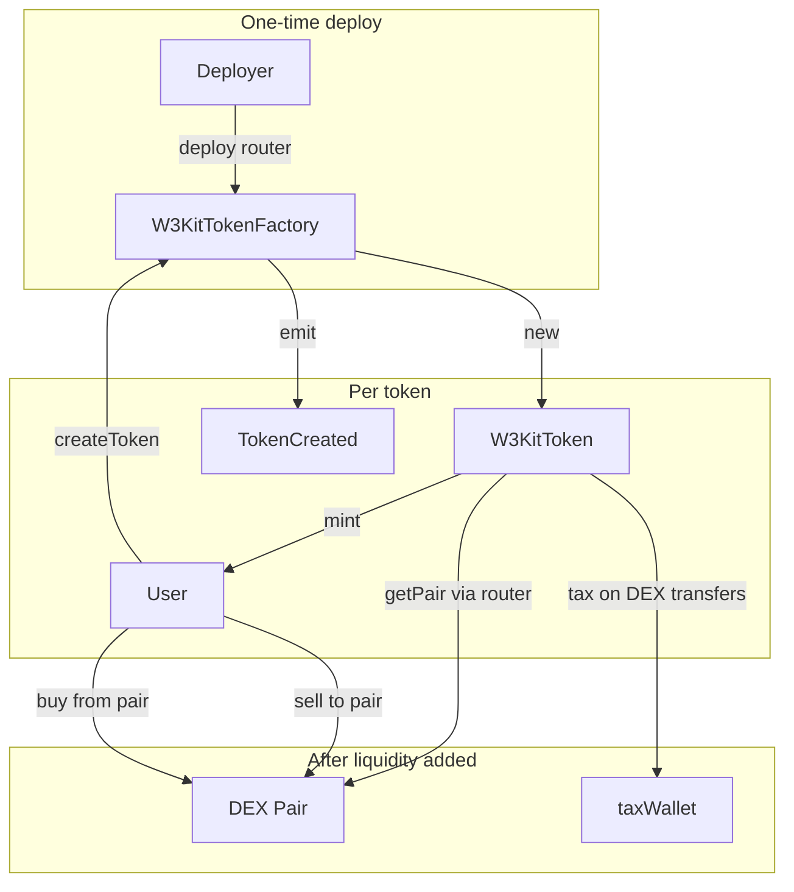

# Web3 Kit Token Factory

On-chain ERC-20 token factory for **BSC** and **Ethereum**. Anyone can deploy a new token through a single factory contract. Tokens support optional **immutable buy/sell tax** on PancakeSwap V2 and Uniswap V2 pairs.

This README is the single source of truth for architecture, configuration, deployment, and integration.

---

## Table of contents

- [How it works](#how-it-works)
- [Architecture](#architecture)
- [Contracts](#contracts)
- [Token parameters](#token-parameters)
- [DEX tax logic](#dex-tax-logic)
- [Validation rules](#validation-rules)
- [Supported networks](#supported-networks)
- [Project structure](#project-structure)
- [Setup](#setup)
- [Environment variables](#environment-variables)
- [Commands](#commands)
- [Deploy factory](#deploy-factory)
- [Create a token](#create-a-token)
- [Verify on explorer](#verify-on-explorer)
- [Frontend integration](#frontend-integration)
- [Security notes](#security-notes)
- [License](#license)

---

## How it works

1. **Deploy** `W3KitTokenFactory` once per chain (with the correct DEX router).
2. Users call **`createToken()`** on the factory.
3. The factory deploys a new **`W3KitToken`** and mints the full supply to `msg.sender`.
4. If tax is enabled, transfers through the token's DEX liquidity pair are taxed automatically after liquidity is added.

```
User wallet
    │
    ▼
W3KitTokenFactory.createToken(...)
    │
    ├── validates inputs
    ├── deploys W3KitToken
    └── mints totalSupply → msg.sender
```

---

## Architecture



| Contract | Role |
|----------|------|
| `W3KitTokenFactory` | Entry point. Validates inputs, deploys tokens, emits `TokenCreated`. |
| `W3KitToken` | ERC-20 (OpenZeppelin v5). Optional immutable buy/sell tax on V2 DEX pairs. |

**Stack:** Solidity `0.8.30` · Hardhat · OpenZeppelin Contracts `^5.6.1` · Ethers `^6`

---

## Contracts

### `W3KitTokenFactory`

Immutable state:
- `router` — DEX router address set at deploy time (PancakeSwap or Uniswap V2).

Main function:

```solidity
function createToken(
    string calldata name,
    string calldata symbol,
    uint8 decimals,
    uint256 totalSupply,
    uint16 buyTaxBps,
    uint16 sellTaxBps,
    address taxWallet
) external returns (address token);
```

Event:

```solidity
event TokenCreated(
    address indexed creator,
    address indexed token,
    string name,
    string symbol,
    uint8 decimals,
    uint256 totalSupply,
    uint16 buyTaxBps,
    uint16 sellTaxBps,
    address taxWallet
);
```

### `W3KitToken`

Standard ERC-20 with configurable `decimals`. Immutable fields set at creation:

| Field | Description |
|-------|-------------|
| `buyTaxBps` | Buy tax in basis points (100 bps = 1%) |
| `sellTaxBps` | Sell tax in basis points |
| `taxWallet` | Receives tax; must be `address(0)` when tax is off |
| `router` | Used to resolve the token/WETH (or WBNB) pair |

No owner, no mint after creation, no tax changes after deploy — all tax settings are **immutable**.

---

## Token parameters

| Parameter | Type | Notes |
|-----------|------|-------|
| `name` | `string` | Required. No max length (byte length = gas cost). |
| `symbol` | `string` | Required. No max length. |
| `decimals` | `uint8` | `0`–`18` (ERC-20 convention). `18` is most common on BSC/ETH. |
| `totalSupply` | `uint256` | Raw smallest units (like wei). `0` not allowed. |
| `buyTaxBps` | `uint16` | `0`–`10000` (100% max). `0` = no buy tax. |
| `sellTaxBps` | `uint16` | `0`–`10000`. `0` = no sell tax. |
| `taxWallet` | `address` | Required when any tax > 0; must be zero when tax is off. |

### `totalSupply` and decimals

`totalSupply` is **not** human-readable — it includes decimal places.

| Goal | decimals | totalSupply (example) |
|------|----------|------------------------|
| 1,000,000 tokens | 18 | `1_000_000 × 10^18` |
| 1,000,000 tokens | 8 | `1_000_000 × 10^8` |
| 1,000,000 tokens | 6 | `1_000_000 × 10^6` |

With ethers.js:

```javascript
ethers.parseUnits("1000000", 18); // 18 decimals
ethers.parseUnits("1000000", 8);  // 8 decimals
```

---

## DEX tax logic

Tax applies only when a **liquidity pair exists** on the chain DEX (resolved via `router.factory().getPair(token, WETH/WBNB)`).

| Transfer direction | Tax applied |
|--------------------|-------------|
| Wallet → DEX pair (sell) | `sellTaxBps` |
| DEX pair → Wallet (buy) | `buyTaxBps` |
| Wallet → Wallet | No tax |
| Before pair is created | No tax |

Tax formula: `taxAmount = amount × taxBps / 10_000`

**Example:** `sellTaxBps = 1000` (10%) on a 1000 token sell → 100 to `taxWallet`, 900 to the pair.

Compatible with:
- **BSC:** PancakeSwap V2
- **Ethereum:** Uniswap V2 Router02

---

## Validation rules

| Rule | Error |
|------|-------|
| Empty name | `EmptyName` |
| Empty symbol | `EmptySymbol` |
| `decimals > 18` | `DecimalsTooHigh` |
| `totalSupply == 0` | `ZeroSupply` |
| Tax on, `taxWallet == 0` | `TaxWalletRequired` |
| Tax off, `taxWallet != 0` | `TaxWalletMustBeZero` |
| Factory deploy with zero router | `ZeroRouter` |

---

## Supported networks

Hardhat network names and chain IDs from `hardhat.config.js`:

| Network | Hardhat name | Chain ID | DEX router |
|---------|--------------|----------|------------|
| BSC Mainnet | `bsc` | 56 | `0x10ED43C718714eb63d5aA57B78B54704E256024E` (PancakeSwap V2) |
| BSC Testnet | `bscTestnet` | 97 | `0xD99D1c33F9fC3444f8101754aBC46c52416550D1` (PancakeSwap V2) |
| Ethereum Mainnet | `eth` | 1 | `0x7a250d5630B4cF539739dF2C5dAcb4c659F2488D` (Uniswap V2) |
| Sepolia | `sepolia` | 11155111 | `0xC532a74256D3Db42D0Bf7a0400fEFDbad7694008` (community Uniswap V2) |

Routers are selected automatically in `scripts/deploy-factory.js` by `chainId`.

---

## Project structure

```
├── contracts/
│   ├── W3KitTokenFactory.sol   # Factory — deploy once per chain
│   ├── W3KitToken.sol          # ERC-20 + optional DEX tax
│   └── mocks/
│       └── MockUniswapV2.sol   # Test doubles for DEX
├── scripts/
│   └── deploy-factory.js       # Deploy factory + print verify command
├── test/
│   └── W3KitTokenFactory.test.js
├── hardhat.config.js
├── .env.example
└── package.json
```

---

## Setup

**Requirements:** Node.js 18+, npm

```bash
git clone <repo-url>
cd "Web3 Kit Token Factory"
npm install
cp .env.example .env
# Edit .env with your private key, RPC URLs, and API keys
```

---

## Environment variables

Copy `.env.example` → `.env`. Never commit `.env`.

| Variable | Required | Purpose |
|----------|----------|---------|
| `PRIVATE_KEY` | Deploy / on-chain tx | Wallet key (64 hex chars, **no** `0x` prefix) |
| `ETH_SEPOLIA_RPC_URL` | Sepolia | RPC endpoint |
| `ETH_MAINNET_RPC_URL` | Ethereum mainnet | RPC endpoint |
| `BSC_TESTNET_RPC_URL` | BSC testnet | RPC endpoint |
| `BSC_MAINNET_RPC_URL` | BSC mainnet | RPC endpoint |
| `ETHERSCAN_API_KEY` | Verify on Etherscan | [etherscan.io/myapikey](https://etherscan.io/myapikey) |
| `BSCSCAN_API_KEY` | Verify on BscScan | [bscscan.com/myapikey](https://bscscan.com/myapikey) |
| `TOKEN_FACTORY_CONTRACT_ADDRESS_*` | Optional | Local record of deployed factory per network |

After deploy, copy the factory address into your frontend `w3kit/.env` using the same key names printed by the deploy script.

---

## Commands

```bash
# Run all tests
npm test

# Compile contracts
npx hardhat compile

# Deploy factory (append --network <name>)
npm run deploy:factory -- --network bscTestnet
npm run deploy:factory -- --network bsc
npm run deploy:factory -- --network sepolia
npm run deploy:factory -- --network eth

# Gas report
REPORT_GAS=true npx hardhat test
```

---

## Deploy factory

```bash
npm run deploy:factory -- --network bscTestnet
```

The script will:
1. Resolve the DEX router for the chain
2. Deploy `W3KitTokenFactory(router)`
3. Print the factory address and `w3kit/.env` key to update
4. Print the `hardhat verify` command

**Constructor argument:** DEX router address (one address).

Example verify (BSC testnet):

```bash
npx hardhat verify --network bscTestnet <FACTORY_ADDRESS> <ROUTER_ADDRESS>
```

For BSC verification, enable `BSCSCAN_API_KEY` in `hardhat.config.js` (currently commented out; Etherscan key is used for ETH/Sepolia).

---

## Create a token

After the factory is deployed, call `createToken` on the factory contract.

### No tax

```javascript
const factory = await ethers.getContractAt("W3KitTokenFactory", FACTORY_ADDRESS);

const tx = await factory.createToken(
  "My Token",           // name
  "MTK",                // symbol
  18,                   // decimals
  ethers.parseUnits("1000000", 18), // totalSupply
  0,                    // buyTaxBps
  0,                    // sellTaxBps
  ethers.ZeroAddress    // taxWallet (must be zero when no tax)
);
const receipt = await tx.wait();
// Parse TokenCreated event for the new token address
```

### With tax (5% buy, 10% sell)

```javascript
await factory.createToken(
  "Tax Token",
  "TAX",
  18,
  ethers.parseUnits("1000000", 18),
  500,                  // 5% buy  (500 bps)
  1000,                 // 10% sell (1000 bps)
  "0xYourTaxWalletAddress"
);
```

Tax only activates after liquidity is added on the DEX pair (token + WBNB/WETH).

---

## Verify on explorer

**Factory** (constructor = router address):

```bash
npx hardhat verify --network bsc <FACTORY_ADDRESS> 0x10ED43C718714eb63d5aA57B78B54704E256024E
```

**Token** contracts are deployed by the factory via `new W3KitToken(...)` — verify individually on BscScan/Etherscan with the full constructor argument list if needed.

---

## Frontend integration

1. Set `TOKEN_FACTORY_CONTRACT_ADDRESS_<NETWORK>` in `w3kit/.env`.
2. Load factory ABI from `artifacts/contracts/W3KitTokenFactory.sol/W3KitTokenFactory.json`.
3. Call `createToken` with user-supplied parameters.
4. Listen for `TokenCreated` to get the new token address.
5. Match `totalSupply` to the selected `decimals` (`parseUnits`).

Do **not** add client-side name/symbol length limits unless you want UX constraints — the on-chain factory has no length cap.

---

## Security notes

- **Immutable tax** — buy/sell rates and `taxWallet` cannot be changed after token creation.
- **No admin on tokens** — no pause, blacklist, or post-deploy mint.
- **Router is fixed per factory** — factory must be deployed with the correct chain router.
- **Tax before liquidity** — no tax until a DEX pair exists; wallet-to-wallet transfers are never taxed.
- **Private keys** — keep `PRIVATE_KEY` in `.env` only; never commit or share.
- **Audit** — review contracts before mainnet use with real funds.

---

## License

MIT (contracts: `SPDX-License-Identifier: MIT`)
